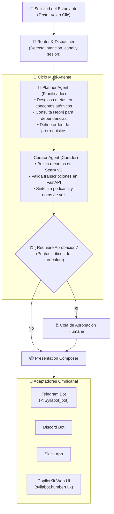
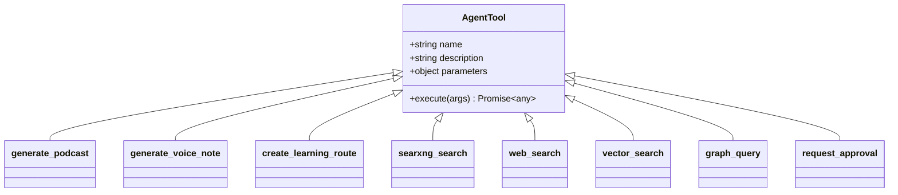
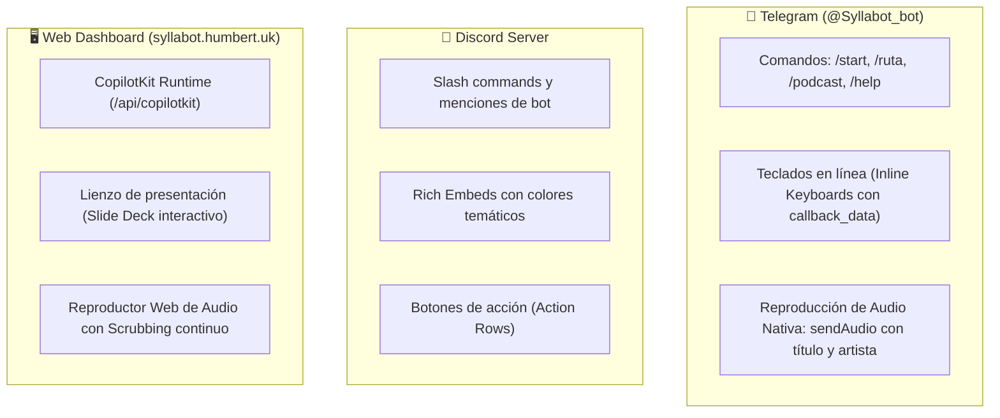
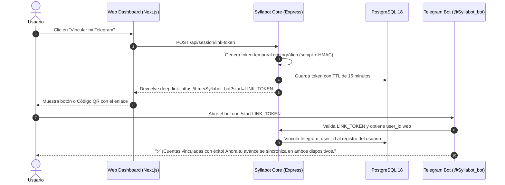

# 🤖 Syllabot — Orquestación de Agentes, Tool Calling y Omnicanalidad

> Guía técnica de la inteligencia agentil, herramientas registradas, adaptadores de mensajería y sincronización de sesiones cross-channel.

---

## 🧠 Arquitectura Multi-Agente

Syllabot utiliza un paradigma de **agentes cooperativos especializados** inspirados en el patrón Supervisor-Especialista. En lugar de delegar todo el razonamiento en un solo modelo monolítico propenso a desviarse o alucinar fuentes, el sistema divide las tareas cognitivas en dos agentes centrales:



### 1. El Agente Planificador (*Planner*)
- **Objetivo:** Transformar un objetivo de aprendizaje abstracto (ej. *"Quiero dominar Transformers y Atención en NLP"*) en una estructura curricular jerárquica y ordenada.
- **Herramientas de cabecera:** `graph_query`, `vector_search`, `create_learning_route`.
- **Estrategia:** Verifica si existen nodos preexistentes en Neo4j. Si el usuario ya domina "Álgebra Lineal", omite pasos elementales y se enfoca en la brecha cognitiva detectada.

### 2. El Agente Curador (*Curator*)
- **Objetivo:** Asignar material multimedia y pedagógico riguroso a cada paso de la ruta.
- **Herramientas de cabecera:** `searxng_search`, `generate_podcast`, `generate_voice_note`, `request_approval`.
- **Regla estricta:** Ningún video es agregado a una ruta curricular si el microservicio `hackathon-agent-transcript` no certifica que el video cuenta con transcripción pública y contenido relevante.

---

## 🛠️ Catálogo de Tool Calling del Agente

Todas las herramientas siguen el estándar de especificación de funciones de OpenAI (`tools` API) y se encuentran orquestadas en `src/tools/index.ts`:



### Tabla de Herramientas Registradas

| Herramienta | Parámetros Clave | Tipo de Retorno | Descripción y Comportamiento |
|---|---|---|---|
| `generate_podcast` | `topic`, `title` (opcional), `turnsCount` (opcional) | `{ id, audioUrl, title, transcript, turns }` | Genera un diálogo fluido estilo NotebookLM entre Alex y Sofía, lo sintetiza con OpenAI TTS (`echo` y `nova`), concatena el audio y devuelve la URL pública de streaming con HTTP 206. |
| `generate_voice_note` | `topic`, `text` (opcional), `voice` (opcional) | `{ id, audioUrl, duration }` | Crea una nota de voz pedagógica concisa (30 a 90 segundos) ideal para explicaciones rápidas en Telegram. |
| `create_learning_route` | `topic`, `difficulty`, `steps` | `{ id, title, stepsCount, steps }` | Genera y persiste una ruta de aprendizaje estructurada en PostgreSQL y Neo4j con módulos, videos validados y tareas. |
| `searxng_search` | `query`, `engines` (opcional), `maxResults` | `Array<{ title, url, snippet, engine }>` | Ejecuta búsquedas agregadas y privadas mediante el contenedor local SearXNG sin depender de APIs propietarias de tracking. |
| `web_search` | `query`, `limit` | `Array<{ title, url, content }>` | Búsqueda web general y extracción de contenido para fundamentar síntesis educativas. |
| `vector_search` | `query`, `collection`, `limit` | `Array<{ id, score, payload }>` | Recupera fragmentos de lecciones y transcripciones indexadas en Qdrant utilizando distancia coseno. |
| `graph_query` | `cypherQuery` o `concept` | `{ nodes, relationships, path }` | Consulta el grafo de conocimiento en Neo4j para encontrar dependencias y conceptos previos no superados. |
| `request_approval` | `action`, `rationale`, `payload` | `{ status: "pending", approvalId }` | Detiene la ejecución autónoma y solicita validación humana (HITL) antes de modificar planes críticos. |

---

## 🎙️ Caso de Uso: Generación Dinámica de Podcasts desde el Agente

Cuando el usuario solicita un formato de audio en cualquier canal (ej: *"Syllabot, hazme un podcast sobre cómo funciona Docker"*), el modelo ejecuta la herramienta `generate_podcast`:

```typescript
// Ejemplo de llamada estructurada ejecutada por el modelo
{
  "name": "generate_podcast",
  "arguments": {
    "topic": "Cómo funciona Docker y la arquitectura de contenedores",
    "title": "Desmitificando Docker: De namespaces a imágenes",
    "turnsCount": 6
  }
}
```

El ciclo interno ejecuta:
1. `generatePodcastDialogue(topic, title, turnsCount)`: Produce los 6 turnos conversacionales con el LLM.
2. `synthesizeTurnAudio(speaker, text)`: Invoca OpenAI TTS con la voz respectiva (`echo` para Alex, `nova` para Sofía).
3. `Buffer.concat(audioChunks)`: Concatena los frames MP3 en memoria y guarda el archivo en `./storage/audio/podcast-{uuid}.mp3`.
4. Inserta el registro en la tabla `podcasts` de PostgreSQL 18.
5. Devuelve la URL absoluta `https://syllabot.humbert.uk/audio/podcast-{uuid}.mp3` para que el adaptador del canal entregue el reproductor nativo.

---

## 📱 Adaptadores Omnicanal

Syllabot ofrece una experiencia nativa adaptada a las características de cada interfaz de usuario:



### 1. Adaptador de Telegram (`src/channels/index.ts`)
- **Long-Polling / Webhook:** Escucha actualizaciones en tiempo real utilizando la API oficial de Telegram Bot.
- **Entrega de Audio Nativa:** Utiliza el método `sendAudio` de Telegram con metadatos enriquecidos (`performer: "Syllabot"`, `title: "Episodio: ..."`, `caption: "🎙️ Tu podcast está listo"`). El usuario puede reproducir el audio en segundo plano en su teléfono con la pantalla bloqueada.
- **Teclados en línea dinámicos:** Después de cada respuesta, el bot genera botones contextuales (`[🎧 Escuchar Podcast]`, `[🚀 Siguiente Paso]`, `[📊 Ver Grafo]`).

### 2. Adaptador de Discord
- Implementado con `discord.js`.
- Renderiza las respuestas pedagógicas en **Embeds** con campos estructurados (*Field Blocks*), distinguiendo conceptos clave, lecturas recomendadas y enlaces a podcasts.

### 3. Adaptador Web y CopilotKit (`src/channels/presentation.ts`)
- Utiliza la integración de CopilotKit para React 19 y Next.js 16.
- El agente puede modificar dinámicamente el estado de la interfaz web del usuario: abrir un modal, proyectar una diapositiva (*Presentation Slide Deck*), cargar una ruta en el lienzo o activar el reproductor de audio integrado.

---

## 🔗 Vinculación de Sesiones Cross-Channel (Identity Linking)

Para que el usuario pueda comenzar una ruta en Telegram mientras viaja y continuarla en su laptop sin perder el progreso, Syllabot implementa un mecanismo criptográfico de vinculación de sesiones:



---

## ⚖️ Aprobación Humana en el Bucle (Human-in-the-Loop)

Para evitar que los agentes realicen cambios drásticos en currículos académicos o consuman cuotas de recursos sin supervisión:
1. El agente invoca `request_approval` con la justificación pedagógica y el plan de cambio.
2. El sistema despacha una tarjeta interactiva con los botones `[✅ Aprobar]` y `[❌ Rechazar]` al canal del tutor o al dashboard del estudiante.
3. La ejecución se suspende de forma segura mediante promesas persistentes o tokens de reanudación hasta recibir el webhook de confirmación.
