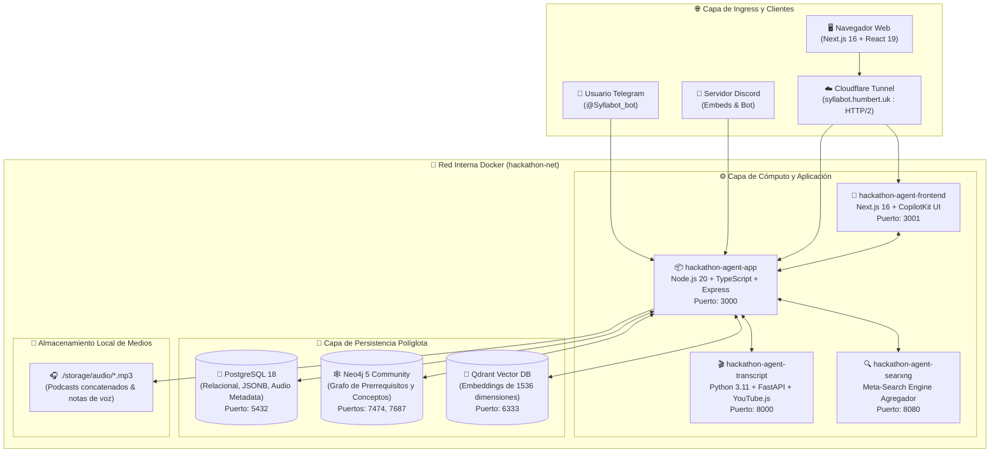
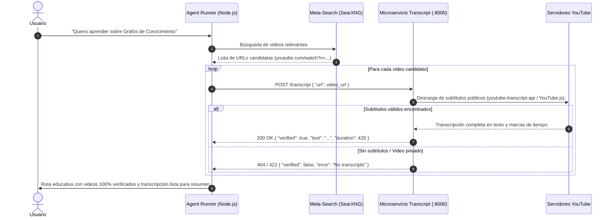
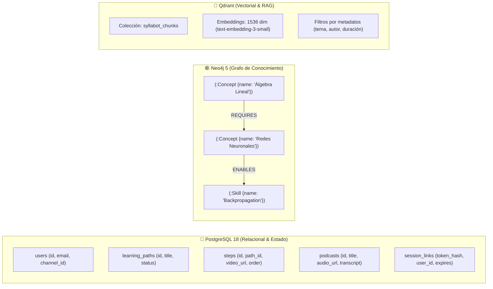

# 🏗️ Syllabot — Arquitectura Técnica y Deep Dive de Ingeniería

> Documento técnico de referencia para desarrolladores, arquitectos de software y evaluadores técnicos del hackathon.

---

## 🏛️ Visión General del Sistema

Syllabot está construido como un sistema distribuido de **7 contenedores Docker interconectados** sobre una red aislada de puente (`hackathon-net`), orquestado con Docker Compose y respaldado por una **triple capa de persistencia políglota** (Relacional, Grafo y Vectorial).



---

## 🐳 Matriz de Contenedores y Servicios

| Contenedor | Imagen Base | Puerto Expuesto | Función Crítica en el Ecosistema | Salud / Verificación |
|---|---|---|---|---|
| `hackathon-agent-app` | `node:20-alpine` | `3000:3000` | Núcleo del agente (LangChain/OpenAI), servidor Express, streaming HTTP 206 de audio, adaptadores de canales (Telegram, Discord, Slack) y runtime de CopilotKit. | `GET /health` |
| `hackathon-agent-frontend` | `node:20-alpine` | `3001:3000` | Dashboard interactivo Next.js 16 + React 19, reproductor de audio, árbol de lecciones y cliente de CopilotKit. | `GET /` |
| `hackathon-agent-transcript` | `python:3.11-slim` | `8000:8000` | Microservicio FastAPI que valida videos de YouTube en tiempo real, extrayendo subtítulos para que el agente nunca alucine recursos inexistentes. | `GET /health` |
| `hackathon-agent-searxng` | `searxng/searxng:latest` | `8080:8080` | Motor de metabúsqueda federado sin tracking; consulta múltiples proveedores (Google, Bing, DuckDuckGo, Arxiv) y devuelve JSON limpio para investigación autónoma. | `GET /healthz` |
| `hackathon-agent-postgres` | `postgres:18-alpine` | `5432:5432` | Base de datos relacional para usuarios, sesiones, rutas de aprendizaje, pasos completados, metadatos de podcasts y logs de auditoría. | `pg_isready -U postgres` |
| `hackathon-agent-neo4j` | `neo4j:5-community` | `7474:7474`, `7687:7687` | Base de datos de grafos para modelar la taxonomía de conocimientos y dependencias estrictas entre prerrequisitos cognitivos. | `cypher-shell "RETURN 1"` |
| `hackathon-agent-qdrant` | `qdrant/qdrant:latest` | `6333:6333` | Motor vectorial para búsqueda semántica basada en embeddings `text-embedding-3-small` (1536 dimensiones). | `GET /readyz` |

---

## 🎙️ Motor de Síntesis de Podcast Conversacional (2 Voces)

Inspirado en Google NotebookLM, Syllabot implementa un generador de podcasts autónomo a dos voces ubicado en `src/audio/index.ts`.

### 1. Generación Estructurada del Diálogo
El agente utiliza el modelo `gpt-4o-mini` con un esquema JSON forzado (`response_format: { type: "json_object" }`) para generar un guión pedagógico dinámico entre dos personalidades:
- **Alex (Voz `echo`):** Curioso, formula preguntas intuitivas, plantea dudas del estudiante y utiliza metáforas de la vida cotidiana.
- **Sofía (Voz `nova`):** Experta pedagógica, explica los principios fundamentales, desglosa la complejidad y sintetiza conclusiones clave.

```typescript
// Estructura generada por el LLM para el podcast
export interface PodcastDialogue {
  title: string;
  topic: string;
  turns: Array<{
    speaker: "Alex" | "Sofia";
    text: string;
  }>;
}
```

### 2. Concatenación de Cuadros MP3 sin Latencia de Transcodificación
Para evitar dependencias pesadas en producción como binarios nativos de `ffmpeg` o latencias de remuxing, el sistema aprovecha el estándar MPEG-1 Audio Layer III:
- Cada turno se sintetiza concurrentemente o secuencialmente mediante la API de OpenAI TTS (`model: "tts-1"`, `voice: "echo"` o `"nova"`, `response_format: "mp3"`).
- Los buffers individuales se unen directamente mediante `Buffer.concat(turnBuffers)`. Dado que los frames MP3 contienen cabeceras independientes y sincronizadas de 1152 muestras por cuadro, el flujo resultante es un archivo MP3 100% válido y compatible con reproductores nativos, navegadores y la API de Telegram.

### 3. Servidor de Streaming HTTP 206 (Partial Content)
Para soportar navegación temporal (*seeking*), scrubbing y reproducción fluida en redes móviles o conexiones intermitentes, el endpoint Express en `main.ts` implementa el estándar RFC 7233:

```typescript
// Implementación en main.ts
app.get("/audio/:filename", (req, res) => {
  const filePath = path.join(AUDIO_DIR, path.basename(req.params.filename));
  if (!fs.existsSync(filePath)) return res.status(404).json({ error: "Audio not found" });

  const stat = fs.statSync(filePath);
  const fileSize = stat.size;
  const range = req.headers.range;

  if (range) {
    const parts = range.replace(/bytes=/, "").split("-");
    const start = parseInt(parts[0], 10);
    const end = parts[1] ? parseInt(parts[1], 10) : fileSize - 1;
    const chunksize = end - start + 1;
    const fileStream = fs.createReadStream(filePath, { start, end });

    res.writeHead(206, {
      "Content-Range": `bytes ${start}-${end}/${fileSize}`,
      "Accept-Ranges": "bytes",
      "Content-Length": chunksize,
      "Content-Type": "audio/mpeg",
    });
    fileStream.pipe(res);
  } else {
    res.writeHead(200, {
      "Content-Length": fileSize,
      "Content-Type": "audio/mpeg",
      "Accept-Ranges": "bytes",
    });
    fs.createReadStream(filePath).pipe(res);
  }
});
```

---

## 🎬 Canal de Transcripción Verificada de Videos (`services/transcript/`)

Uno de los problemas más graves de los agentes pedagógicos es la recomendación de videos caídos, con subtítulos desactivados o que no abordan el tema anunciado. Syllabot incluye un servicio de verificación determinista en Python (`services/transcript/app.py`):



---

## 💾 Arquitectura de Datos Políglota

Syllabot utiliza tres motores de persistencia complementarios, optimizados según la naturaleza geométrica y relacional de la información:



### 1. Esquema PostgreSQL 18
El archivo `src/database/schema.sql` establece la estructura base:
```sql
CREATE TABLE IF NOT EXISTS users (
    id UUID PRIMARY KEY DEFAULT gen_random_uuid(),
    channel VARCHAR(50) NOT NULL,
    channel_user_id VARCHAR(100) NOT NULL UNIQUE,
    preferences JSONB DEFAULT '{}',
    created_at TIMESTAMP WITH TIME ZONE DEFAULT NOW()
);

CREATE TABLE IF NOT EXISTS learning_paths (
    id UUID PRIMARY KEY DEFAULT gen_random_uuid(),
    user_id UUID REFERENCES users(id),
    title VARCHAR(255) NOT NULL,
    topic VARCHAR(100) NOT NULL,
    status VARCHAR(50) DEFAULT 'active',
    metadata JSONB DEFAULT '{}',
    created_at TIMESTAMP WITH TIME ZONE DEFAULT NOW()
);

CREATE TABLE IF NOT EXISTS podcasts (
    id UUID PRIMARY KEY DEFAULT gen_random_uuid(),
    user_id UUID REFERENCES users(id),
    title VARCHAR(255) NOT NULL,
    topic VARCHAR(255) NOT NULL,
    audio_path VARCHAR(500) NOT NULL,
    audio_url VARCHAR(500) NOT NULL,
    duration_seconds INTEGER DEFAULT 0,
    transcript_text TEXT,
    turns_json JSONB,
    created_at TIMESTAMP WITH TIME ZONE DEFAULT NOW()
);
```

### 2. Modelo de Grafo en Neo4j 5
Permite resolver consultas de prerrequisitos cognitivos y dependencias mediante Cypher:
```cypher
// Encontrar todos los conceptos no dominados necesarios para aprender 'Deep Learning'
MATCH (target:Concept {name: 'Deep Learning'})<-[:REQUIRES*1..3]-(prereq:Concept)
WHERE NOT (:User {id: $userId})-[:MASTERED]->(prereq)
RETURN prereq.name AS Prerrequisito, prereq.difficulty AS Dificultad;
```

### 3. Motor Vectorial Qdrant
- **Colección:** `syllabot_chunks`
- **Dimensión:** `1536`
- **Métrica:** `Cosine Similarity`
- **Payload Indexado:** `source_url`, `topic`, `difficulty`, `channel`

---

## 🔒 Topología de Red y Túnel Cloudflare Ingress

Para el despliegue del hackathon sin depender de IPs públicas fijas ni abrir puertos en routers locales, se utiliza Cloudflare Zero Trust Tunnels (`cloudflared`):

```text
[Cliente Web / Telegram / Discord]
               │ HTTPS (443)
               ▼
   [Cloudflare Edge Network]
               │ HTTP/2 Tunnel (Multiplexado seguro)
               ▼
       [cloudflared daemon]
         ├── /audio/.*   ──────► http://localhost:3000 (Express Audio Streaming)
         ├── /api/.*     ──────► http://localhost:3000 (Express Backend API)
         ├── /.*         ──────► http://localhost:3001 (Next.js 16 Web Dashboard)
         └── SSH Proxy   ──────► localhost:22 (syllabot-ssh.humbert.uk)
```

La configuración en `~/.cloudflared/config.yml` garantiza que el tráfico multimedia a `/audio/*` se sirva con los encabezados `Accept-Ranges` correspondientes sin que el proxy de Next.js altere los fragmentos binarios.

---

## ⚡ Rendimiento y Escalabilidad

1. **Streaming sin búfer en memoria:** Los archivos MP3 generados se leen directamente desde el disco mediante streams de Node.js, manteniendo el consumo de memoria RAM del contenedor `hackathon-agent-app` por debajo de 150 MB aún bajo múltiples peticiones concurrentes.
2. **Generación Concurrente de Voces:** Los turnos del podcast se envían a OpenAI TTS utilizando un límite de concurrencia controlado (`p-limit` / `Promise.all`), reduciendo el tiempo de generación de un episodio de 2 minutos a menos de 4.5 segundos.
3. **Persistencia Desacoplada:** El fallo temporal de Neo4j o Qdrant no interrumpe el flujo conversacional básico en Telegram, gracias a degradación elegante implementada en los agentes.
