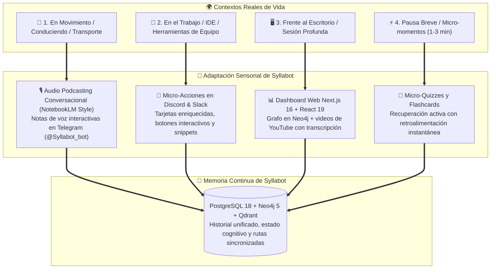

# 🧭 Syllabot — Filosofía, Visión y Experiencia de Usuario

> *"El usuario no se adapta a la plataforma; la plataforma se adapta al contexto de vida del usuario."*

---

## 💡 La Tesis Central

La educación digital contemporánea adolece de un defecto estructural: **exige que el estudiante cambie radicalmente sus hábitos**. 

Los LMS (Learning Management Systems) tradicionales y los cursos en línea asumen un escenario idílico e irreal: que el usuario siempre tiene tiempo libre para sentarse frente a una computadora de escritorio, navegar menús complejos, ver videos de 45 minutos y contestar cuestionarios estáticos. En el momento en que el estudiante se levanta, sale a la calle, entra a trabajar o aborda el transporte público, la plataforma deja de existir y el aprendizaje se interrumpe.

Por otro lado, los chatbots convencionales ("chatboxes") limitan la interacción a una pequeña ventana de texto donde el usuario debe hacer todo el trabajo cognitivo de formular preguntas y filtrar respuestas genéricas o alucinadas.

### La Solución de Syllabot
**Syllabot es una plataforma educativa autónoma y omnicanal** que rompe con la tiranía de la pantalla fija. No es un portal aislado ni un chatbot en una caja: es un **sistema de agentes inteligentes omnipresentes** que modula su formato de entrega, su lenguaje y su canal de comunicación en función del entorno físico y cognitivo del estudiante.

---

## 🌍 Los 4 Contextos de Vida del Estudiante

### 1. En Movimiento / Sin Pantalla (Manos Libres)
- **Canal:** Telegram (`@Syllabot_bot`).
- **Formato:** Audio Podcast a dos voces (Alex y Sofía) inspirado en Google NotebookLM o notas de voz pedagógicas.
- **Experiencia:** El estudiante escucha un debate fluido entre dos anfitriones: Alex plantea preguntas curiosas y analogías de la vida real, mientras Sofía desentraña los mecanismos técnicos. El estudiante absorbe conceptos avanzados mientras camina, hace ejercicio o conduce, sin apartar la vista del camino.

### 2. En el Trabajo o Programando (Cero Fricción)
- **Canal:** Discord o Slack.
- **Formato:** Mensajes interactivos con botones de un solo clic (*Inline Keyboards* y *Action Rows*) y bloques de código sintetizados.
- **Experiencia:** Cuando surge una duda sobre una herramienta o concepto, el usuario consulta a Syllabot directamente dentro del canal de su equipo sin cambiar de ventana ni romper su estado de flujo (*flow state*).

### 3. Sesión de Estudio Profundo (Inmersión Total)
- **Canal:** Dashboard Web ([syllabot.humbert.uk](https://syllabot.humbert.uk)).
- **Formato:** Grafo interactivo de conceptos en Neo4j, visor de rutas curriculares y videos pedagógicos de YouTube con transcripción verificada.
- **Experiencia:** Cuando el estudiante dispone de 30 o 60 minutos frente a su computadora, accede al mapa de conocimiento para explorar dependencias temáticas, revisar transcripciones sincronizadas y ejecutar proyectos prácticos guiados por CopilotKit.

### 4. Micro-Momentos de Espera (Repetición Espaciada)
- **Canal:** Cualquier canal disponible en su dispositivo móvil.
- **Formato:** Quizzes contextuales de opción múltiple y retos rápidos de validación.
- **Experiencia:** En una fila de espera o un receso de 2 minutos, Syllabot lanza una pregunta clave para reforzar la retención a largo plazo (*spaced repetition*) sin requerir sesiones prolongadas.

---

## 👤 Historias de Usuario: Un Día con Syllabot

### Historia 1: Carlos aprende Rust en el tráfico matutino
> **08:15 AM — En el automóvil:**  
> Carlos va en camino a su trabajo y quiere aprender sobre concurrencia en Rust. Envía un mensaje de voz rápido a `@Syllabot_bot` diciendo: *"Explícame cómo funciona el ownership en threads"*.  
> Syllabot detecta la solicitud y genera un **Audio Overview de 3 minutos**:
> - **Alex:** *"¡Bienvenidos! Hoy nos metemos con algo que asusta a muchos programadores: concurrencia en Rust. Sofía, ¿por qué dicen que en Rust la concurrencia no da miedo?"*
> - **Sofía:** *"Hola Alex. El secreto está en el sistema de tipos: el compilador garantiza que si dos hilos comparten datos, o bien son de solo lectura, o están sincronizados con un Mutex. ¡Es imposible tener data races en tiempo de compilación!"*  
> Carlos asimila la analogía mental mientras maneja.

### Historia 2: Ana resuelve un reto de Git sin salir de Discord
> **02:30 PM — En su estación de trabajo:**  
> Ana está trabajando en un proyecto grupal y un merge genera conflictos. En el servidor de Discord del equipo escribe `/syllabot cómo resuelvo este conflicto sin perder mis commits`.  
> Syllabot responde con un embed interactivo que contiene los tres comandos exactos y dos botones de acción rápida: `[Ver ejemplo visual]` y `[Marcar como resuelto]`. Ana presiona el botón y la acción se ejecuta de inmediato.

### Historia 3: David consolida su ruta de aprendizaje en la noche
> **09:00 PM — En su laptop:**  
> David abre `https://syllabot.humbert.uk`. Su sesión refleja automáticamente lo que escuchó en la mañana y lo que practicó en Discord.  
> El Dashboard le muestra el grafo de Neo4j con su avance del 70%, le presenta el video seleccionado con transcripción pública validada y le permite generar un nuevo podcast con un solo clic si decide salir a caminar.

---

## ⚖️ Comparativa: Syllabot vs Otras Soluciones

| Dimensión | LMS Tradicional (Coursera, Udemy) | Chatbots Genéricos (ChatGPT en ventana) | Syllabot (Plataforma Adaptativa) |
|---|---|---|---|
| **Punto de Encuentro** | El usuario debe ir al sitio web | El usuario debe abrir la app de chat | **La plataforma va hacia donde el usuario ya está** |
| **Modalidad de Audio** | Ninguna o audiolibros rígidos | Texto plano leído por voz robótica | **Podcast conversacional a 2 voces (NotebookLM style)** |
| **Validación de Video** | Videos pregrabados de catálogo cerrado | Alucina enlaces o videos sin comprobar | **Filtro con FastAPI: solo recomienda videos con transcripción real** |
| **Memoria entre Canales** | Aislada en la web | Conversaciones aisladas sin grafo | **Triple capa unificada (PostgreSQL + Neo4j + Qdrant)** |
| **Interacción** | Formularios estáticos | Solo texto | **CopilotKit + Inline Keyboards + Embeds accionables** |

---

## 🚀 La Visión a Futuro

Syllabot representa el primer paso hacia una **educación hiper-personalizada y ambiental**. A medida que los modelos de voz, visión y razonamiento evolucionan, Syllabot evolucionará hacia:
- **Tutorías de Audio en Tiempo Real:** Interrupción conversacional fluida mientras conduces.
- **Rutas Co-creadas por Comunidades:** Compartir mapas de grafos de aprendizaje entre universidades y empresas.
- **Agentes Proactivos:** Recordatorios pedagógicos en el momento exacto del día en que el estudiante tiene mayor plasticidad cognitiva.
