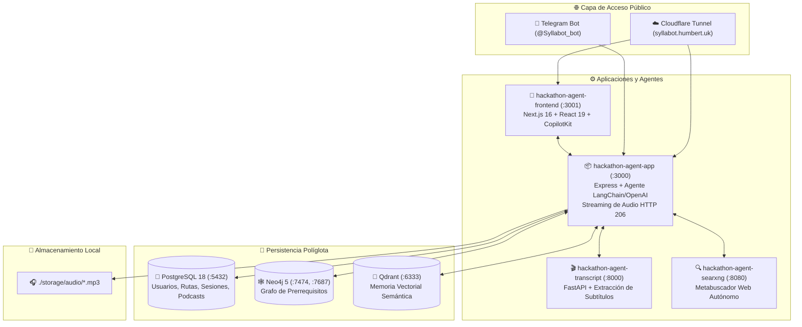

# 🎓 Syllabot — Plataforma Educativa Autónoma y Omnicanal
### *"El usuario no se adapta a la plataforma; la plataforma se adapta a la vida del usuario."*

**AI Tinkerers Monterrey & OpenAI Global Hackathon 2026**
*Track: Agents Everywhere — Beyond The Chatbox*

[](https://syllabot.humbert.uk)
[](https://copilotkit.ai)
[](https://www.typescriptlang.org/)
[](https://fastapi.tiangolo.com)
[](https://postgresql.org)
[](https://neo4j.com/)
[](https://qdrant.tech/)
[](http://localhost:8080)
[-F38020?style=flat&logo=cloudflare)](https://cloudflare.com)
[](#-suite-de-pruebas)

---

## 💡 La Tesis: Educación que se Encuentra Contigo Donde Ya Estás

La educación digital tradicional comete un error de raíz: **exige que el estudiante sacrifique sus hábitos y se siente frente a un monitor estático**. Cuando el usuario sale a la calle, conduce, entra a su trabajo o viaja en transporte público, las plataformas dejan de existir y el aprendizaje se interrumpe.

Por otro lado, los chatbots convencionales ("chatboxes") limitan la experiencia a una ventana de texto pasiva que no conoce el contexto ni el entorno físico del usuario.

> **Syllabot reinventa la experiencia educativa:**
> Es un **sistema multi-agente autónomo y omnicanal** que modula dinámicamente su formato de entrega, su lenguaje y su canal de comunicación en función del entorno y la atención del estudiante:
> - 🚶 **¿Vas caminando o en el coche?** Syllabot te acompaña por Telegram con **podcasts conversacionales a 2 voces (estilo NotebookLM)** que se reproducen nativamente en segundo plano sin obligarte a ver la pantalla.
> - 💼 **¿Estás en tu jornada laboral o programando?** Te atiende en **Discord o Slack** con micro-tarjetas, botones de un solo clic y fragmentos de código sin romper tu concentración.
> - 🖥️ **¿Te sientas frente a tu laptop a estudiar a fondo?** Te ofrece un **Dashboard Web en Next.js 16** con tu grafo de conocimientos en Neo4j, diapositivas guiadas con CopilotKit y videos de YouTube con **transcripción 100% verificada**.
> - ⚡ **¿Tienes 2 minutos de espera?** Te lanza flashcards y micro-quizzes para consolidar la retención espaciada (*spaced repetition*).

---

## 📚 Directorio de Documentación Especializada

Para evitar documentos monolíticos inmanejables, la documentación de Syllabot se organiza en guías modulares con diferentes perspectivas técnicas y narrativas:

| Documento | Enfoque / Audiencia | Temas Destacados |
|---|---|---|
| 🧭 [**Visión y Filosofía Pedagógica**](Doc/VISION_NARRATIVA.md) | **Producto y Pedagogía** | Tesis de adaptación contextual, los 4 entornos de vida, historias de usuario (Carlos, Ana, David) y comparativa vs LMS tradicionales. |
| 🏗️ [**Arquitectura Técnica y Deep Dive**](Doc/ARQUITECTURA_TECNICA.md) | **Backend e Infraestructura** | Matriz de los 7 contenedores Docker, motor de audio a 2 voces, streaming HTTP 206 RFC 7233, DDL de PostgreSQL 18, Cypher en Neo4j y túnel Cloudflare. |
| 🤖 [**Agentes, Canales y Tool Calling**](Doc/AGENTES_Y_MULTICANAL.md) | **IA y Omnicanalidad** | Orquestador Planner + Curator, catálogo completo de herramientas (*tools*), adaptadores de Telegram, Discord y Slack, y vinculación de sesiones cross-channel. |
| 🚀 [**Guía Práctica, Despliegue y Operaciones**](Doc/GUIA_PRACTICA_Y_DESPLIEGUE.md) | **DevOps y Ejecución** | Inicio rápido en 3 minutos con `./start-dev.sh`, recetario de comandos `curl`, resolución de WiFis restringidos en hackathons y variables `.env`. |

---

## 🌐 Enlaces y Servicios en Vivo

| Servicio | URL Pública / Acceso | Puerto Local | Descripción |
|---|---|---|---|
| 🖥️ **Web Dashboard (Next.js 16)** | [https://syllabot.humbert.uk](https://syllabot.humbert.uk) | `3001` | Interfaz interactiva del estudiante con CopilotKit, árbol de rutas y reproductor de audio. |
| 📱 **Bot Oficial de Telegram** | [@Syllabot_bot](https://t.me/Syllabot_bot) | `3000` | Agente omnicanal con teclados inline, notas de voz y streaming de podcasts nativo (`sendAudio`). |
| 🎙️ **Demo de Podcast Conversacional** | [Escuchar Audio Generado (1.06 MB)](https://syllabot.humbert.uk/audio/podcast-c098c727-f518-405a-9005-31e6bd6d133a.mp3) | `3000` | Episodio real a 2 voces (Alex & Sofía) generado de forma autónoma sobre Agentes de IA. |
| 🩺 **Backend Health Check** | [https://syllabot.humbert.uk/health](https://syllabot.humbert.uk/health) | `3000` | Estado de conexión en tiempo real de los 7 contenedores y persistencia. |
| 🎬 **Microservicio Transcripts** | `http://localhost:8000/docs` | `8000` | API FastAPI en Python para validación y descarga de transcripciones de YouTube. |
| 🔍 **SearXNG Metasearch Local** | `http://localhost:8080` | `8080` | Motor de búsqueda federado privado (Google, Bing, DuckDuckGo, Arxiv) sin rastreo. |
| 🕸️ **Neo4j Graph Browser** | `http://localhost:7474` | `7474` / `7687` | Explorador del grafo de conocimiento y relaciones de prerrequisitos cognitivos. |
| 🎯 **Qdrant Vector Dashboard** | `http://localhost:6333/dashboard` | `6333` | Inspección visual de colecciones y embeddings de 1536 dimensiones. |
| 🐘 **PostgreSQL 18** | `localhost:5432` | `5432` | Base de datos relacional para usuarios, sesiones, rutas y metadatos de audio. |
| 🔒 **Acceso Remoto SSH** | `syllabot-ssh.humbert.uk` | `22` | Túnel seguro por Cloudflare Proxy (acceso remoto en eventos sin abrir puertos). |

---

## 🐳 Arquitectura de 7 Contenedores Docker

Todos los componentes corren aislados y sincronizados sobre la red interna `hackathon-net`:



---

## 🌟 4 Innovaciones Clave de Syllabot

### 1. 🎙️ Audio Podcasting Conversacional a 2 Voces (NotebookLM Style)
- Generación dinámica de un diálogo pedagógico entre dos personalidades: **Alex** (curioso, formulador de preguntas y analogías, voz `echo`) y **Sofía** (mentora técnica, explicaciones concisas y conclusiones, voz `nova`).
- **Concatenación de cuadros MP3 sin dependencias de transcodificación (`ffmpeg`):** une directamente los buffers de cuadros MPEG Layer III a alta velocidad.
- **Streaming HTTP 206 (Partial Content):** soporte completo de cabeceras `Range` para navegación y *seeking* instantáneo en navegadores y reproductores móviles.

### 2. 🎬 Pipeline de Transcripción Determinista de YouTube
- Previene alucinaciones recomendando únicamente videos cuyos subtítulos existen y han sido extraídos en milisegundos por el microservicio `hackathon-agent-transcript` (`services/transcript/`).
- El agente resume y crea preguntas basadas en el contenido real del video, no en suposiciones.

### 3. 🧠 Triple Persistencia Unificada
- **PostgreSQL 18:** Registro relacional de usuarios, rutas de estudio, pasos, sesiones y metadatos de podcasts generados.
- **Neo4j 5:** Grafo de conocimiento que modela la topología de conceptos previos (`(:Concept)-[:REQUIRES]->(:Concept)`).
- **Qdrant:** Motor de búsqueda vectorial con embeddings de 1536 dimensiones para recuperación contextual inmediata.

### 4. 📱 Experiencia Nativa Multicanal con Identidad Compartida
- En **Telegram**, el bot utiliza `sendAudio` para desplegar el reproductor nativo del sistema operativo del usuario.
- Mediante tokens criptográficos temporales (`/start <token>`), el estudiante vincula su sesión web con su cuenta de Telegram o Discord en un solo clic, sincronizando su estado sin requerir login tradicional repetitivo.

---

## ⚡ Inicio Rápido (3 Comandos)

```bash
# 1. Clonar el repositorio
git clone <URL_DEL_REPOSITORIO>
cd "OpenAI Global Hackathon"

# 2. Configurar variables de entorno
cp .env.example .env

# 3. Levantar la plataforma completa
./start-dev.sh
```

---

## 🧪 Suite de Pruebas

El sistema cuenta con una suite completa de pruebas unitarias y de integración que valida el agente, herramientas, contratos y adaptadores de mensajería:

```bash
npm test
```

```text
 PASS  src/tools/index.test.ts
 PASS  src/channels/telegram.test.ts
 PASS  src/router/index.test.ts
 PASS  src/hitl/index.test.ts
 PASS  src/jobs/index.test.ts

Test Suites: 5 passed, 5 total
Tests:       22 passed, 22 total
Snapshots:   0 total
Time:        1.842 s
Ran all test suites.
```

---

## 👥 Créditos & Hackathon
- **Proyecto:** Syllabot — Plataforma Educativa Autónoma y Omnicanal
- **Autor:** Daniel Humberto Reyes Rocha (`daniel@humbert.uk`)
- **Hackathon:** AI Tinkerers Monterrey & OpenAI Global Hackathon (*Agents Everywhere: Beyond The Chatbox*) — Septiembre 2026
- **Tecnologías:** OpenAI (`gpt-4o`, `tts-1`) · CopilotKit · Next.js 16 · React 19 · Node.js 20 · Express · FastAPI · PostgreSQL 18 · Qdrant · Neo4j 5 · SearXNG · Cloudflare
